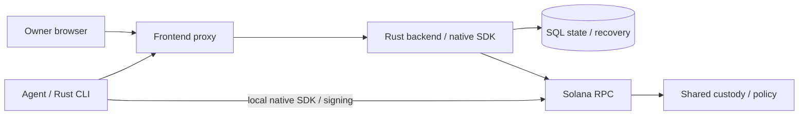

# AllowIt — Policy-Controlled Agent Spending

[](LICENSE)
[](docs/evidence.md)

> AllowIt gives agents bounded spending authority through owner-approved policies, a native Rust SDK and Solana vaults.

[Live Application](https://app.allowit.xyz) · [Architecture](docs/architecture.md) · [Repositories](repos/README.md)

Video walkthrough and submission links: pending. Demo image: pending. The live application entrypoint does not identify the reviewed Rust Preview.

---

## Submission to Colosseum

| Name | Role | Contact |
| --- | --- | --- |
| Alex Astrum | tech, vision and SI alignment | [GitHub](https://github.com/alexastrum) |
| Max | BD, marketing and operations | [GitHub](https://github.com/mks044) |
| Igor Stolyarov | software engineering (front-end) | [GitHub](https://github.com/Magurin) |
| Mukhammedali Beriktassuly | software engineering (smart contracts) | [GitHub](https://github.com/beriktassuly) |

---

## Problem and Solution

### 1. Excessive Agent Authority

**Problem:** An unrestricted signer can exceed the owner's intended spending authority.

**AllowIt:** A separate executor signs bounded vault spending. The owner retains approval, revocation and withdrawal authority.

### 2. Repeated Owner Signing

**Problem:** Approval of each transfer interrupts unattended execution.

**AllowIt:** The native vault uses standing owner approval and a chain-enforced daily limit.

### 3. Unclear Policy Boundaries

**Problem:** A policy description can promise checks that the actual payment path does not enforce.

**AllowIt:** The SDK validates restricted Rust. The native kernel exposes its pinned approval and daily-limit rules. Generic semantic evaluation remains separate.

### 4. Uncertain Submission

**Problem:** A lost response can cause an agent to submit another spend.

**AllowIt:** Signed journals preserve the original identity. Recovery checks finalized effects before recording settlement.

## Why Solana

- Program-derived accounts bind vault state to the owner, executor and accepted policy release.
- Native policy invocation and SPL transfer share a transaction with atomic accounting.
- Finalized receipts expose exact program and token effects.
- Shared programs support separate owner instances without deploying an executable for every wallet.

## Summary of Features

- Native Rust SDK and CLI with separate policy and Solana client packages.
- Rust backend with API, lifecycle, storage and integration crates.
- React frontend with a thin API proxy and owner wallet signing.
- Pinned native policy, vault initialization, standing approval and funding.
- Executor transfers within the daily limit, with finalized receipt checks.
- Pause, tune, revoke, withdraw and original-proof recovery.
- Generic restricted-policy evaluation, owner questions and scoped agent access.

See [product](docs/product.md) for users and policy profiles.

## Tech Stack

| Layer | Technology |
| --- | --- |
| On-chain programs | Native Rust Solana policy and custody programs, classic SPL Token |
| SDK / Client | Native Rust policy SDK, separate Solana SDK, native Rust CLI |
| Frontend | React, Vite, TypeScript, wallet adapter, IndexedDB journal |
| Backend | Rust API, engine, storage and integration crates |
| Hosted transport and storage | Thin TypeScript proxy, Vercel Rust function, PostgreSQL |
| Testing | SDK/CLI checks, compiled-program tests, browser tests and Testnet receipts |

## Architecture



See [architecture](docs/architecture.md) for components, signing, persistence and deployment. Main Preview uses this Rust architecture. Production retains its earlier integration.

## Quick Start

Prerequisites: Git, Rust and an explicitly configured native test environment. Use the [CLI requirements](repos/AllowIt-hq--allowit-cli/README.md#build-from-source).

```sh
git clone --recurse-submodules https://github.com/AllowIt-hq/Colosseum.git
cd Colosseum
cd repos/AllowIt-hq--allowit-cli
cargo build --locked --release
./target/release/allowit --help
```

For an existing checkout, run `git submodule update --init --recursive`.

Follow [commands and API](docs/api.md) for service configuration and the native lifecycle. Configure the accepted release, network, mint and separate owner/executor signers before signing. This repository contains reports and pinned source submodules.

## Roadmap

- [x] Native Rust SDK and CLI source ports.
- [x] Rust backend and thin frontend proxy in main Preview.
- [x] Bounded Solana Testnet deployment, funding, spending, revocation and withdrawal.
- [ ] Hosted generic-provider acceptance.
- [ ] Production continuity, routing and release acceptance.
- [ ] Native CLI Release and physical-wallet acceptance.
- [ ] Additional rails and paid-service delivery.

See the [full roadmap](docs/roadmap.md) and [evidence](docs/evidence.md).

## Resources

- [Live Application](https://app.allowit.xyz)
- [Public SDK](repos/AllowIt-hq--allowit-sdk/README.md)
- [Public CLI](repos/AllowIt-hq--allowit-cli/README.md)
- [Public Solana Contracts](repos/AllowIt-hq--allowit-contracts-solana/README.md)
- [Architecture](docs/architecture.md) and [validation evidence](docs/evidence.md)
- Presentation and video demo: pending. Team contacts appear in the submission section.

## License

MIT for this documentation. See [LICENSE](LICENSE). Included source repositories retain their own licenses.

Adapted from the [original Colosseum template](https://github.com/Marakaya/colosseum_example/tree/315695b07dbf4c2fff3c0144a31c9153ddc0fdce). Use the [completion guide](docs/completion-guide.md) for outstanding submission fields.
