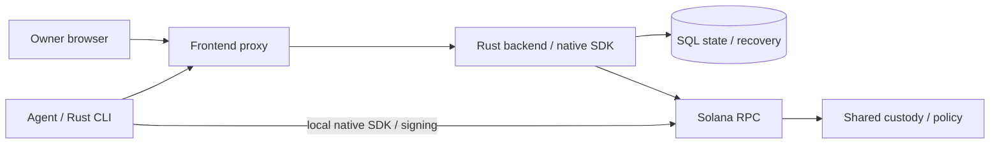

# AllowIt — Go on. On your terms.

[](LICENSE)
[](docs/evidence.md)

> AllowIt lets your AI agents spend and invest, within a policy you set.

[Website](https://allowit.xyz) · [Live Application](https://app.allowit.xyz) · [Architecture](docs/architecture.md) · [Repositories](repos/README.md)

---

## Submission to Colosseum

| Name | Role | Contact |
| --- | --- | --- |
| Alex Astrum | tech, vision and SI alignment | [GitHub](https://github.com/alexastrum) · [Writing](https://hi.astrum.name) |
| Max | BD, marketing and operations | [GitHub](https://github.com/mks044) |
| Igor Stolyarov | software engineering (front-end) | [GitHub](https://github.com/Magurin) |
| Mukhammedali Beriktassuly | software engineering (smart contracts) | [GitHub](https://github.com/beriktassuly) |

---

## Problem and Solution

People already hand AI agents real work. They do not yet hand them the money. AllowIt connects the two with a policy. The agent acts inside the policy, asks you when a request is unclear and stops at the boundary.

### 1. A wallet key gives too much authority

**Problem:** An agent needs payment authority to finish work that requires paid tools or data. A wallet key lets it spend everything the wallet holds, on anything.

**AllowIt:** You give the agent a policy, not your key. On Solana, the native vault gives a designated executor spending authority. It binds that authority to one asset and a daily limit. Your owner key stays with you.

### 2. Approving every payment stops the work

**Problem:** If you sign each payment, the agent waits for you and the task stalls.

**AllowIt:** You approve the policy once. Inside it, the agent goes ahead. The vault checks the policy and makes the transfer in the same transaction. A transfer above the daily limit fails.

### 3. A limit cannot judge intent

**Problem:** A spending limit says how much. It cannot say whether a purchase serves the job you described.

**AllowIt:** The backend can evaluate generic restricted policies with semantic evidence tied to the exact request. It sends unclear requests to you. The native vault checks executor identity, standing approval, asset, daily limit, nonce and policy revision.

### 4. Plans change

**Problem:** When the job ends or goes wrong, you must stop the agent, get the funds back and know what already happened.

**AllowIt:** You can pause the vault, tune the limit, revoke the approval or withdraw the funds. Signed journals and finalized receipts show what each operation did. The client uses them to recover an operation after a lost response.

## Why Solana

- Program-derived accounts bind vault state to the owner, executor and accepted policy release.
- Native policy invocation and SPL transfer share a transaction with atomic accounting.
- Finalized receipts expose exact program and token effects.
- Shared programs support separate owner instances without deploying an executable for every wallet.

## Summary of Features

- Native Rust SDK and CLI with separate policy and Solana client packages.
- Rust backend with API, lifecycle, storage and integration crates.
- React frontend with a thin API proxy and owner wallet signing.
- Pinned native policy, vault initialization, standing approval and funding.
- Executor transfers within the daily limit, with finalized receipt checks.
- Pause, tune, revoke, withdraw and original-proof recovery.
- Generic restricted-policy evaluation, owner questions and scoped agent access.

See [product](docs/product.md) for users and policy profiles.

## Tech Stack

| Layer | Technology |
| --- | --- |
| On-chain programs | Native Rust Solana policy and custody programs, classic SPL Token |
| SDK / Client | Native Rust policy SDK, separate Solana SDK, native Rust CLI |
| Frontend | React, Vite, TypeScript, wallet adapter, IndexedDB journal |
| Backend | Rust API, engine, storage and integration crates |
| Hosted transport and storage | Thin TypeScript proxy, Vercel Rust function, PostgreSQL |
| Testing | SDK/CLI checks, compiled-program tests, browser tests and Testnet receipts |

## Architecture



See [architecture](docs/architecture.md) for components, signing, persistence and deployment. Main Preview and Production use this Rust architecture.

## Quick Start

Prerequisites: Git, Rust and an explicitly configured native test environment. Use the [CLI requirements](repos/AllowIt-hq--allowit-cli/README.md#build-from-source).

```sh
git clone --recurse-submodules https://github.com/AllowIt-hq/Colosseum.git
cd Colosseum
cd repos/AllowIt-hq--allowit-cli
cargo build --locked --release
./target/release/allowit --help
```

For an existing checkout, run `git submodule update --init --recursive`.

Follow [commands and API](docs/api.md) for service configuration and the native lifecycle. Configure the accepted release, network, mint and separate owner/executor signers before signing. This repository contains reports and pinned source submodules.

## Roadmap

- [x] Native Rust SDK and CLI source ports.
- [x] Rust backend and thin frontend proxy in main Preview.
- [x] Bounded Solana Testnet deployment, funding, spending, revocation and withdrawal.
- [ ] Hosted generic-provider acceptance.
- [x] PostgreSQL continuity, independent routing and Rust Production release.
- [ ] Native CLI Release and physical-wallet acceptance.
- [ ] Additional rails and paid-service delivery.

See the [full roadmap](docs/roadmap.md) and [evidence](docs/evidence.md).

## Resources

- [Website](https://allowit.xyz)
- [Live Application](https://app.allowit.xyz)
- [SDK](repos/AllowIt-hq--allowit-sdk/README.md)
- [CLI](repos/AllowIt-hq--allowit-cli/README.md)
- [Solana Contracts](repos/AllowIt-hq--allowit-contracts-solana/README.md)
- [Architecture](docs/architecture.md) and [validation evidence](docs/evidence.md)

## License

MIT for this documentation. See [LICENSE](LICENSE). Included source repositories retain their own licenses.
