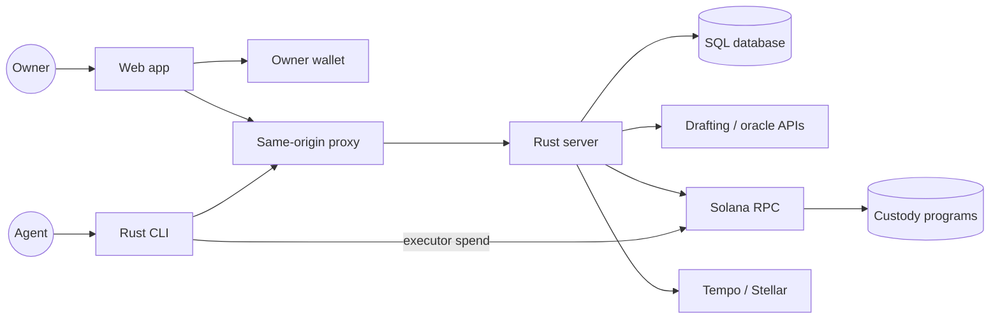
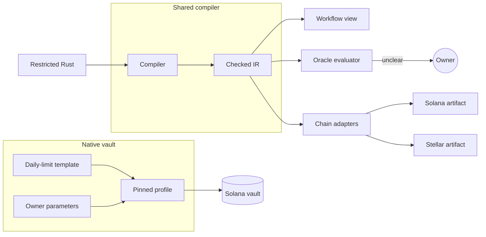
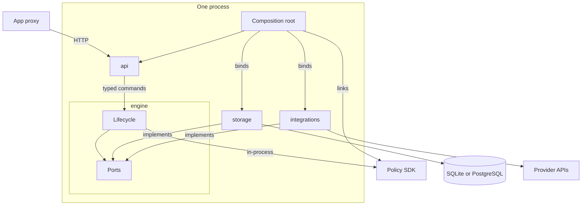
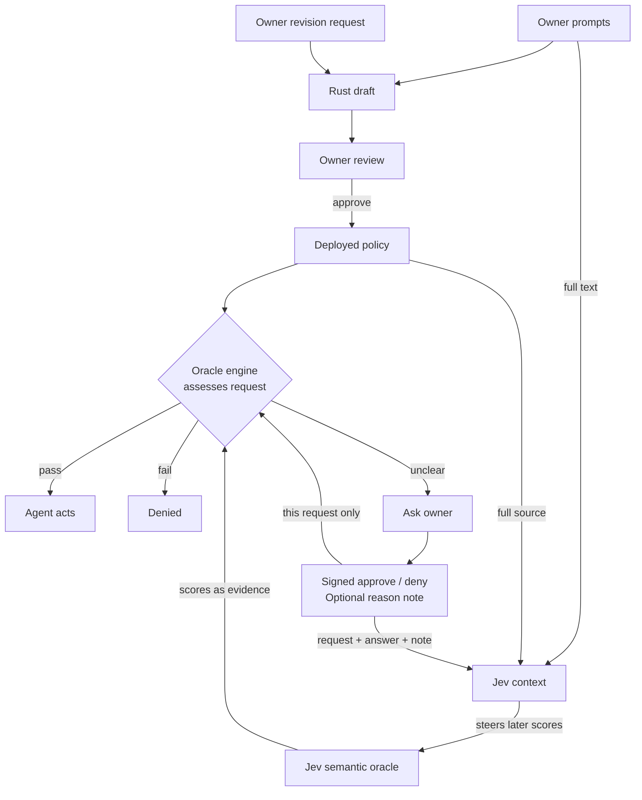
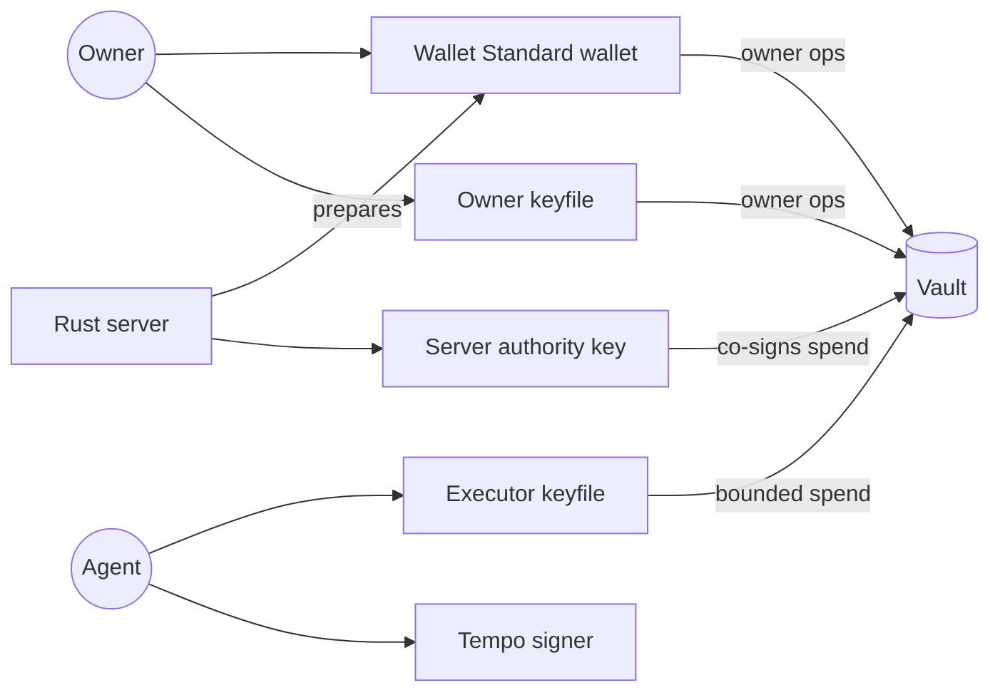
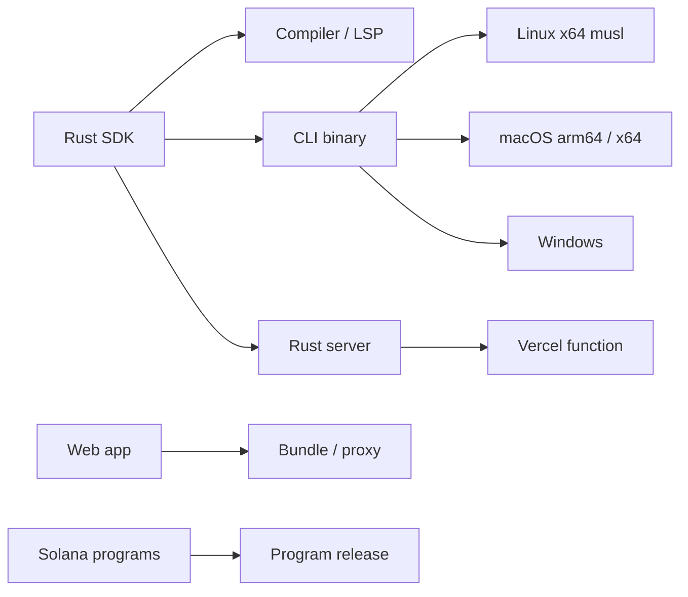
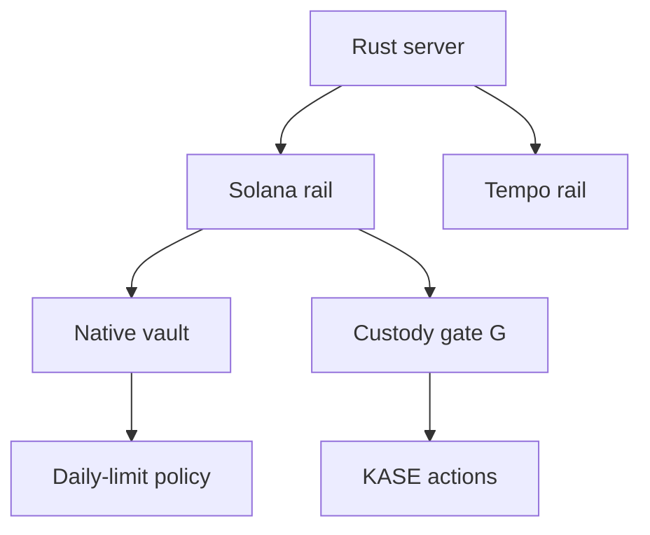
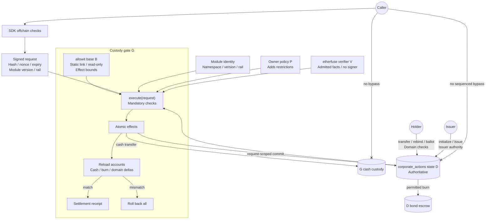

# Architecture

## System Overview

AllowIt places a policy between an AI agent and its owner's funds. The owner sets the terms once. The agent acts inside those terms. When the policy cannot decide, it asks the owner.

### Why restricted Rust

Restricted Rust is the policy language for these reasons:

1. **One mandate source.** The owner approves one policy source. Shared validation keeps workflow views and backend evaluation consistent. Solana programs enforce the native profile.
2. **Bounded validation.** The compiler accepts only a checked subset and rejects arbitrary native code. Execution is deterministic, with bounded size, depth and integer arithmetic. A policy can branch, but it can call only registered system operations.
3. **Readable policies.** Compiler output drives workflow blocks in the app, with help text for predefined calls. Other code stays visible as custom code.
4. **Shared libraries.** Policy rules and the Solana client are Rust crates. Domain modules use the same library model. The CLI, backend and contracts reuse these crates.
5. **Chain targets.** Solana and Stellar programs use Rust. Each target still needs its own output, ABI and runtime binding.

A policy ends in pass or fail. It can request owner input first, but only the trusted oracle engine can wait. In an on-chain profile, that request fails the transaction. Funds never wait inside a contract for a human.

Restricted Rust provides one mandate source. Compiler emits checked IR for workflow view and oracle evaluator. Each chain needs its own artifact and ABI, so Solana runs pinned daily-limit template with owner parameters, not compiled owner source.

### One backend

The backend is one Rust process built from four crates: API, engine, storage and integrations. It links the policy SDK as a library, so no separate policy-engine service adds a hop, deployment or failure mode. The engine owns lifecycle state and defines ports that storage and integrations implement, so dependencies have no cycle.

The private `allowit-engine` repository holds the backend. A native HTTP binary and a Vercel function share one application library. A deployment uses SQLite with persistent local storage, or PostgreSQL in production, because function-local files are not durable.

One Rust process links policy SDK in-process, so no engine HTTP hop or extra service. Engine owns lifecycle state and ports. Storage and integrations implement those ports, so dependencies point inward without cycles. Composition root binds one SQL adapter.

### Independent frontend

The React and TypeScript frontend lives in the private `app.allowIt.xyz` repository, so it deploys independently of the backend. A thin same-origin proxy forwards versioned requests, cookies and original credentials to one fixed backend. Its service credential grants no owner authority. Validation, decisions and transaction preparation stay in Rust.

## Components

### Policy SDK

The [SDK](../repos/AllowIt-hq--allowit-sdk/README.md) ([GitHub README](https://github.com/AllowIt-hq/allowit-sdk/blob/main/README.md)) has two Rust packages. The root package holds the compiler, checked IR, interpreter, function registry, workflow projection and language server. The `native-rust` package is the Solana client. It checks releases, prepares and signs transactions and checks receipts. This split keeps the compiler independent of any chain.

### Native CLI

The [CLI](../repos/AllowIt-hq--allowit-cli/README.md) ([GitHub README](https://github.com/AllowIt-hq/allowit-cli/blob/main/README.md)) is one Rust binary for agents and owners. Agent commands (`show`, `eval`, `exec`, `status`) ask the backend to decide. Native `policy` commands run the SDK in-process for generation, signing and RPC. The binary needs no Node runtime and links no backend crate.

### Solana Programs

The [Solana contracts](../repos/AllowIt-hq--allowit-contracts-solana/README.md) ([GitHub README](https://github.com/AllowIt-hq/allowit-contracts-solana/blob/main/README.md)) supply a shared custody program and an immutable policy program. An operator releases these programs once, and each owner creates vault state under that release.

The native profile is a fixed, approved daily-limit template with owner-set parameters, not arbitrary owner Rust. Generic Rust policies run through the backend oracle. Vault ABI 2 binds owner, executor, server authority, asset, policy version, action limit, daily limit, standing approval and instance slot. Each spend needs the executor and server authority signatures on one transaction. That transaction binds the server's assessment commitment, nonce, revision, instance slot and an expiry of at most 300 seconds. Custody invokes the policy and moves tokens in one atomic transaction, without judging merchant or purpose. This native vault does not use the generic `execute(request)` gate.

### Owner Feedback Lifecycle

Jev is the semantic oracle. It is a model service that scores semantic questions, such as preference fit. The trusted oracle engine in the backend sends Jev each question with bound context, checks the result and evaluates the policy. A Jev result is evidence only. Policy rules, limits and custody checks stay hard checks, and Jev cannot override them.

The backend drafts restricted Rust from owner prompts and checks it with the real compiler. The owner revises through dialogue and approves one revision.

Jev context keeps the full original owner prompts and the full deployed policy. When an assessment is unclear, the owner wallet signs approve or deny for that exact assessed request. The owner can add a reason note of up to 2000 UTF-8 bytes. The signed challenge binds that note. The context keeps the assessed request, the answer and the note for the same policy revision. Jev uses these records to steer later semantic scores. A note grants no authority and cannot override policy limits or hard checks. An answer does not change the policy.

A policy revision starts only from an explicit owner request. The backend makes a new draft, checks it with the compiler and waits for owner approval. Thus AllowIt never changes a policy silently.

### Wallets and Signing

The browser accepts any Wallet Standard wallet that can connect and sign messages and legacy transactions on Solana Testnet. Sign-in uses a signed message, and owner operations use signed transactions. The app suggests Phantom or Solflare.

Owner and agent use separate CLI keyfiles. The executor keyfile can only spend within standing approval. A native spend also needs the server authority signature on the same transaction, after server checks pass. That signature is trusted authorization, not proof of semantic correctness. The backend prepares owner transactions but holds no owner or executor key. Each rail has its own signing adapter.

### Packaging and Platforms

The CLI packages one `allowit` binary per platform. Platform targets are Linux x64, macOS Apple Silicon, macOS Intel and Windows. The Linux musl build avoids dynamic runtime dependencies. The backend runs as a Vercel function, native binary or container, and the frontend has its own Vercel project. The SDK pins accepted Solana program identities.

### Corporate Actions and Rails

**KASE corporate actions.** The `corporate_actions` domain covers coupons, maturity redemption and advisory holder votes. Holder positions stay in program custody. Each record date seals an immutable snapshot. A typed ABI derives each payment and burn with exact integer arithmetic.

**Request execution.** In the generic custody gate profile for KASE corporate actions, gate cash actions and sequenced domain commits have one public entrypoint: `execute(request)`. The daily-limit native vault keeps its separate vault ABI 2 spend path. The SDK checks the policy offchain and then signs the exact request. The signature covers the request hash, nonce, expiry, module versions and rail binding. The custody gate authenticates the request and rechecks mandatory invariants against current chain state. It then applies all effects in one atomic transaction. After the effects, G reloads the relevant accounts and checks the cash, burn and consumed-domain deltas. Only then does G record its settlement receipt. A failed check or a delta mismatch reverts effects, spending and nonce use. The contract stores no separate authorization grant. SDK checks cannot replace gate checks. Holder position transfers, destination rebinding and ballots are separate typed domain actions. They move no cash and do not use the gate sequence. Initialization and issuance go directly to D under the approved issuer authority. That issuer path is separate from the holder-signed actions.

**Module roles.** These labels are roles, not contract methods:

- **G, custody gate.** Owns cash custody, owner scope, budgets, reserves, action sequence, replay markers and settlement receipts. It executes exact cash transfers and keeps its cash signer private.
- **D, domain state.** Holds authoritative domain data, such as `corporate_actions` positions, snapshots, obligations, ballots and bond escrow. It performs permitted bond burns with its own escrow authority. For sequenced commits, G authorizes D with a separate request-scoped authority. D receives no G cash signer. Holders sign nonspending position transfers, destination rebinding and ballots directly to D, and D enforces mandatory domain checks on each. Initialization and issuance require the approved issuer authority.
- **B, shared base.** Read-only `allowit` checks for binding, approval, replay, budget and effect bounds. It links statically into G, so it needs no separate deployment or cross-program call.
- **P, owner policy.** Adds restrictions. It cannot remove mandatory gate or domain checks.
- **V, vendor verifier.** Read-only. It supplies admitted facts, such as `etherfuse` order data, and receives no custody signer.

**Operation namespaces.** A public operation prefix names the documented origin of an operation. `allowit` covers portable rules and corporate-action rules. Corporate-action operations, such as coupon, record, redemption and vote operations, follow the naming pattern `allowit::<subject>_<action>`, for example `allowit::coupon_calculate`. This pattern is a naming convention, not a literal function or sub-namespace. A name that follows it resolves only through an exact registry entry. `solana`, `stellar` and `tempo` name rail profiles. `jev` names semantic calls. `etherfuse` and other documented vendor prefixes name vendor endpoints. Domain and module labels are not operation prefixes: `corporate_actions` names domain state D only. Policy source accepts the exact registered `allowit::` aliases for 16 core operations, plus `jev::semantic` and `jev::check_preference`. Each qualified alias lowers to the same canonical operation as its flat name. Every compiler and runtime binding must support that exact registry. The compiler resolves only exact registered entries. It never strips an unknown prefix to reach a suffix. A prefix grants no authority. Each module identity binds its namespace, version and rail deployment, and that identity cannot change after release.

SDK signs exact request after offchain checks. Base B links statically into G and checks binding, approval, replay, budget and effect bounds, with no separate deployment or cross-program call. G rechecks mandatory invariants and applies all effects atomically. G moves cash with its own signer. D commits sequenced changes and permitted bond burns under request-scoped G authority, without G cash signer. G then reloads accounts and checks cash, burn and consumed-domain deltas before it records its settlement receipt. A failed check or mismatch rolls back all effects. Policy and vendor roles stay read-only and hold no custody signer. Policy only adds restrictions. Direct calls cannot bypass G for cash or sequenced commits. Holder-signed position transfers, destination rebinding and ballots go directly to D, which enforces mandatory domain checks. Initialization and issuance also go directly to D, but under approved issuer authority, separate from holder routes.

**Tempo rail.** The rail adapter binds network, asset, fees and signer. It handles receipts and maps policy enforcement to rail capabilities. Each rail needs a proven Rust target or an enforcement adapter.

## Authority Comparison

AllowIt keeps custody, owner keys, agent keys and semantic judgement apart. The native kernel never consults a model.

| Profile | Who authorizes a spend? | Enforcement |
| --- | --- | --- |
| Native vault | Owner grants standing approval. Executor and server authority sign each spend. | Custody and policy programs enforce asset, action and daily limits, approval, nonce, expiry and instance slot. |
| Allowance | Owner signs each exact transfer. | Backend evaluates policy and checks finalized effects. |
| Generic policy | Backend, with rules, oracle evidence and owner answers. | Backend. On-chain profiles fail on owner input. |
| Corporate actions | Owner approves a servicing executor. Holders sign votes. | Custody gate through `execute(request)` for cash and sequenced commits, with linked `allowit` base checks. `corporate_actions` domain state checks issuer-authorized initialization and issuance, and holder transfers, rebinding and votes. |

See [commands](api.md) for operational use.
