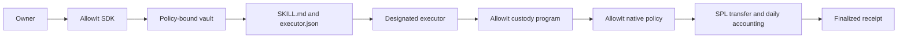

# Architecture

AllowIt infrastructure supplies the browser SDK, native Rust SDK/CLI, native policy program and custody program.

## Policy and custody

Shared executables are provisioned once. Each vault has a PDA state account and a classic SPL Token account. Deploying an owner policy creates and binds those accounts; it does not deploy a new executable per wallet.

The pinned policy's `execute` calls `require_approval` and `enforce_daily_limit`. Daily rollover, clock/overflow checks and the compiled ceiling live in the pinned system-function implementation. Daily limits use UTC calendar days and six-decimal units. Owner tuning is bounded to 0–50 tokens; zero pauses spending. Funding and tuning preserve counters.

Custody verifies the executor, approval, bound asset, nonce, revision and policy artifact before invocation. It commits the returned next daily spend atomically with the token transfer. Policy-source identity and deployed-artifact identity are separate bindings.

## Signing and recovery

Owner and executor keys remain separate. Owner commands initialize/approve, fund, tune, revoke and withdraw. The executor signs spending transactions under standing approval; it never loads the owner key.

The SDK verifies signed messages, persists signed bytes before broadcast and retries the same recorded transaction. A missing response is uncertainty, not failure or permission to create a replacement spend. Settlement requires the recorded message, expected policy/SPL invocations and exact token deltas. Local journals are not a distributed signing service.

## Limits

The daily cap is per vault and does not constrain recipient purpose. Revocation and owner withdrawal preserve recovery without requiring policy execution. Mainnet, distributed journal coordination, arbitrary prompt compilation and paid-service delivery require separate work.
