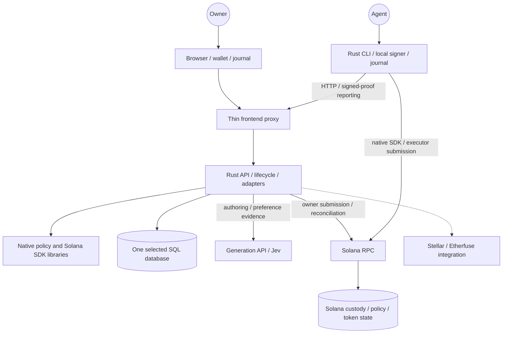
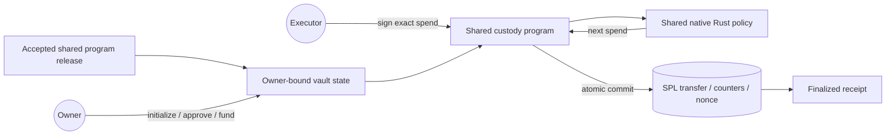

# Architecture

## System Overview

Updated October 7, 2026. This report uses the architecture diagrams authored on October 6 and their latest updates.

AllowIt separates policy rules, application state, signing and on-chain custody. The native Rust SDK supplies policy and Solana client libraries. The Rust CLI and backend use these libraries directly. The browser reaches the backend through a thin TypeScript proxy. Shared Solana programs enforce the native vault policy and transfer tokens atomically.

This condensed view follows the authored Rust-server and deployment diagrams. Solid arrows show current runtime paths. Dashed arrows show future integrations.

Each deployment selects one authoritative database adapter. Hosted staging uses PostgreSQL. SQLite requires persistent local storage. FileStore supports local compatibility tests. Database transactions protect request identity, reservations and recovery leases. Provider calls run outside database locks.

The proxy forwards original owner or agent authentication, cookies and request identity. Its service credential grants no owner authority. Only an authenticated owner session can answer owner questions. Agent capabilities grant scoped policy access or reporting. Test mocks grant no live spending authority.

Generic restricted policies can request Jev evidence or owner input. The host binds evidence to the policy revision, exact action and complete bounded context. Caller facts remain claims until authenticated. Jev point scores remain point scores. Numeric limits apply independently. These oracle functions do not extend the native vault kernel's on-chain rules.

## Components

### Policy SDK

The [public SDK submodule](../repos/AllowIt-hq--allowit-sdk/README.md) supplies two separate Rust packages for the native target. The root package compiles restricted Rust, validates typed intermediate representation, evaluates policies and supplies registry, workflow and language-server metadata. It rejects arbitrary native execution. The `native-rust/` package validates Solana releases, prepares transactions, signs locally, validates receipts and maintains an operation journal.

The SDK also retains JavaScript lifecycle references under `native/` and generic IR contract adapters under `contracts/`. Those adapters do not supply the recorded native vault release. Its shared programs come from the separate Solana contracts repository.

### Native CLI

The [public CLI submodule](../repos/AllowIt-hq--allowit-cli/README.md) supplies the agent and owner command surface. HTTP commands use the application API. Native policy commands call the Solana SDK in the same process. The binary needs no Node runtime or backend crate dependency. Reviewed SDK source mirrors keep CLI builds reproducible.

### Rust Backend

The private `allowit-engine` repository contains the application backend under `server/`. Its application library composes four crates: API, engine, storage and integrations. API handles authentication and request translation. Engine owns policies, reservations, revisions, approvals and recovery. Storage implements transactional persistence. Integrations obtain provider and chain evidence through engine-owned interfaces. Native HTTP and Vercel entrypoints use the same application library.

### Frontend and Proxy

The private `app.allowIt.xyz` repository contains the React frontend, wallet adapter, browser journal and `api/proxy.ts`. The proxy transports versioned requests to a fixed backend. Policy validation and transaction preparation use the backend's native SDK. The browser checks signing intent and retains signed proofs locally.

### Solana Programs

The private `allowit-contracts-solana` repository supplies the shared policy and custody programs. Contract builds produce Solana executables separately from application builds. The organization also maintains separate website and Stellar contract repositories.

Platform release and owner instance creation are separate operations. The release operator builds shared custody and policy executables, deploys them and verifies finalized identities. Acceptance checks genesis, program IDs, loader linkage, executable hashes and upgrade authority. Source hashes and executable hashes identify different artifacts. The current client requires both pinned programs to be immutable.

An owner creates vault state under an accepted release. Generation selects a pinned daily-limit template and parameters. It does not compile arbitrary owner Rust or deploy a new executable for each wallet.

Vault state binds owner, executor, mint, policy identity, daily limit, approval, nonce and revision. Deployment initializes and approves the instance. Funding is a separate owner operation. The executor signs later transfers under standing approval.

The pinned policy calls `require_approval` and `enforce_daily_limit`. System functions check UTC daily rollover, clock validity, arithmetic and the compiled ceiling. Amounts use six-decimal units. The owner can tune the daily limit from zero to 50 tokens. Zero pauses spending. Funding and tuning preserve counters. A policy switch clears approval.

Custody checks executor identity, approval, asset, nonce, revision and policy artifact before invocation. It commits the returned daily spend and SPL transfer together. The native kernel permits recipients within its daily cap. It does not enforce merchant identity, task purpose or semantic preferences. Each vault has its own budget. The separate allowance profile requires an owner signature for each spend.

### Signing, Recovery and Deployment

Owner keys stay in the wallet or owner-controlled CLI files. Executor keys remain separate. Backend preparation grants no signing authority. SKILL.md describes permitted commands. An exported executor bundle can contain a private audit capability and must remain private.

The browser and CLI persist exact signed bytes before submission. The backend saves browser proofs in SQL before broadcasting. An executor bundle with an audit capability requires durable SQL acknowledgement before CLI broadcast. Standalone CLI execution uses its local journal and RPC. The audit acknowledgement is cooperative client behavior. The backend independently reconciles receipts and vault nonces. Recovery retains the original request and signed identity. Finalized receipts must match the expected message, program invocations and token changes.

A lost response leaves an uncertain operation. Status reconciles that operation without signing a replacement. Method-specific expiry evidence can establish non-execution. Uncertain funding or withdrawal can require another explicitly authorized owner operation.

Frontend and Rust backend releases remain independent. Current main Preview uses the proxy and Rust backend. Production retains its earlier integration. Backend native Git routing remains planned. Contract release changes require compatible SDK and backend pins.

The bounded Rust Testnet lifecycle passed deploy, fund, executor spend, revoke, withdrawal and recovery checks. Hosted generic generation remains blocked by provider errors. Stellar, Etherfuse, PaySH payment delivery and hosted-agent execution remain outside this MVP. Lean checks run offline against specific pinned models. They do not certify authentication, storage, provider truth or whole-system correctness.

See [evidence](evidence.md) for revisions and [commands](api.md) for operational use.

## Authority Comparison

| Profile | Who authorizes a spend? | Enforcement |
| --- | --- | --- |
| Native vault | Owner grants standing approval. Designated executor signs each spend. | Shared Solana policy and custody enforce asset, daily cap, nonce and revision. |
| Allowance | Owner signs each exact transfer. | Backend evaluates policy and checks finalized transfer effects. |
| Executor audit capability | Executor reports signed proofs. It gains no owner authority. | CLI waits for SQL acknowledgement. Backend independently reconciles receipts and nonces. |
