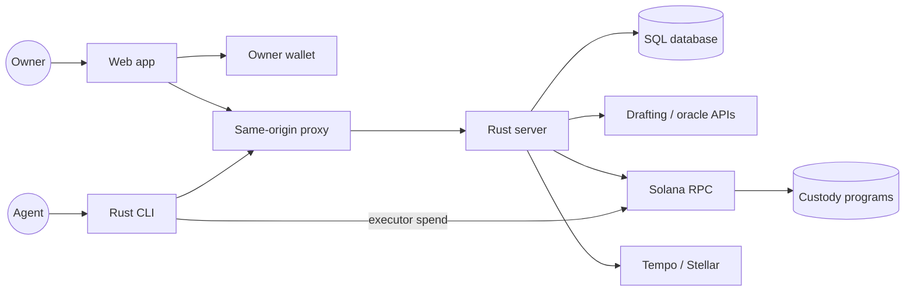
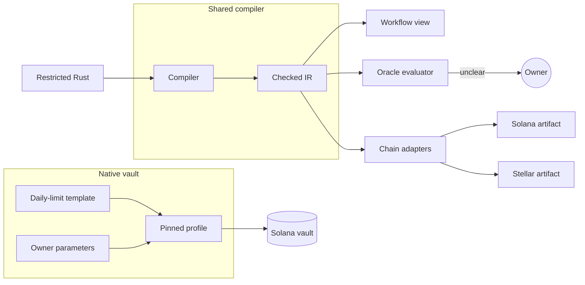
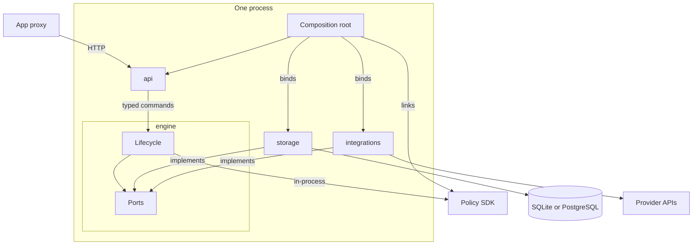
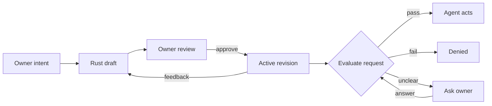
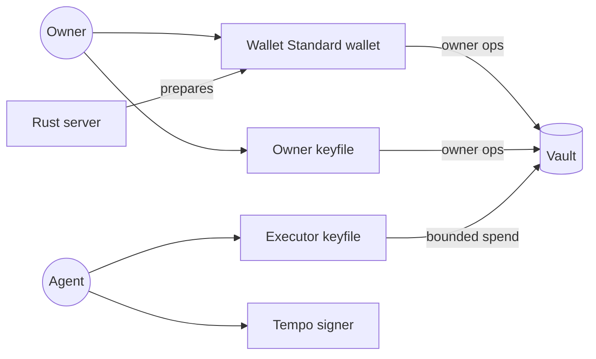
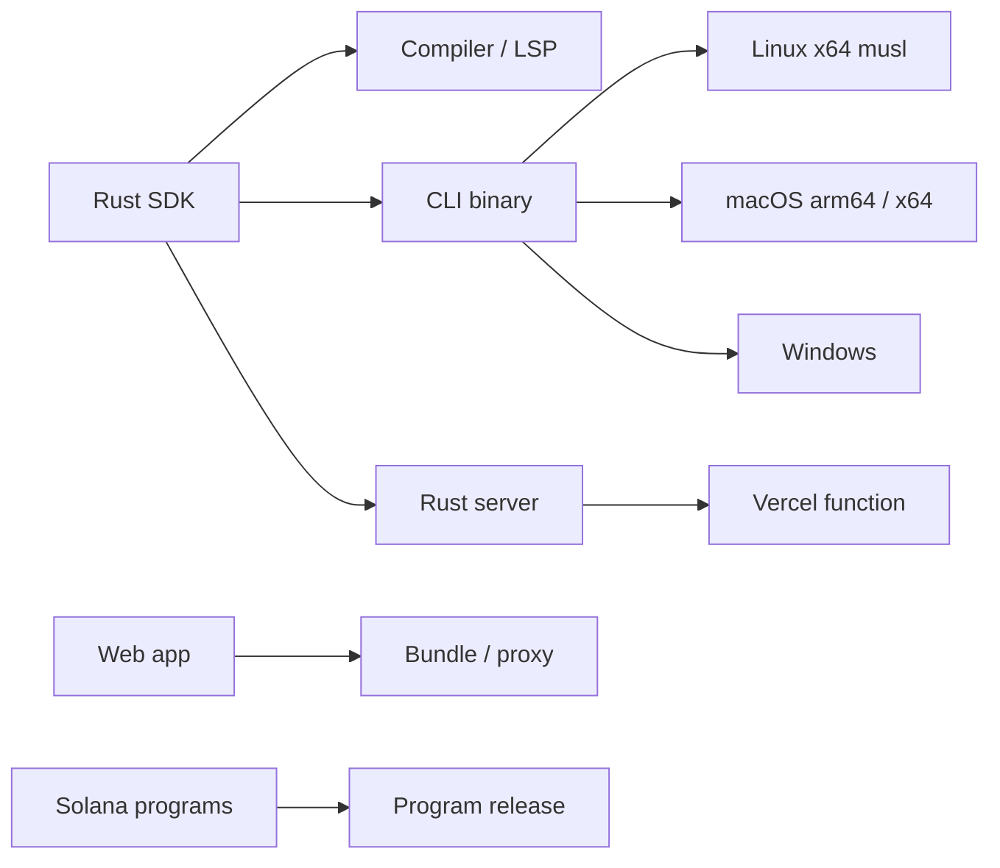
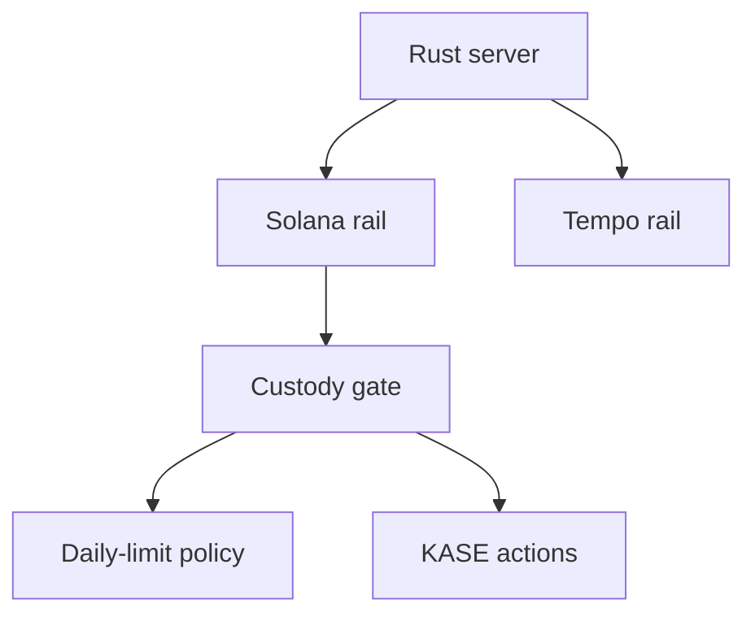
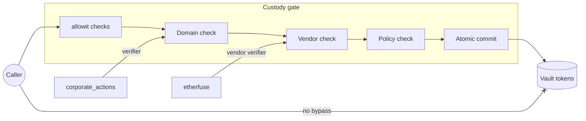

# Architecture

## System Overview

AllowIt places a policy between an AI agent and its owner's funds. The owner sets the terms once. The agent acts inside those terms. When the policy cannot decide, it asks the owner.

### Why restricted Rust

Restricted Rust is the policy language for these reasons:

1. **One mandate source.** The owner approves one policy source. Shared validation keeps workflow views and backend evaluation consistent. Solana programs enforce the native profile.
2. **Bounded validation.** The compiler accepts only a checked subset and rejects arbitrary native code. Execution is deterministic, with bounded size, depth and integer arithmetic.
3. **Readable policies.** Compiler output drives workflow blocks in the app, with help text for predefined calls. Other code stays visible as custom code.
4. **Shared libraries.** Policy rules and the Solana client are Rust crates. Domain modules use the same library model. The CLI, backend and contracts reuse these crates.
5. **Chain targets.** Solana and Stellar programs use Rust. Each target still needs its own output, ABI and runtime binding.

A policy ends in pass or fail. It can request owner input first, but only the trusted oracle engine can wait. In an on-chain profile, that request fails the transaction. Funds never wait inside a contract for a human.

Restricted Rust provides one mandate source. Compiler emits checked IR for workflow view and oracle evaluator. Each chain needs its own artifact and ABI, so Solana runs pinned daily-limit template with owner parameters, not compiled owner source.

### One backend

The backend is one Rust process built from four crates: API, engine, storage and integrations. It links the policy SDK as a library, so no separate policy-engine service adds a hop, deployment or failure mode. The engine owns lifecycle state and defines ports that storage and integrations implement, so dependencies have no cycle.

The private `allowit-engine` repository holds the backend. A native HTTP binary and a Vercel function share one application library. A deployment uses SQLite with persistent local storage, or PostgreSQL in production, because function-local files are not durable.

One Rust process links policy SDK in-process, so no engine HTTP hop or extra service. Engine owns lifecycle state and ports. Storage and integrations implement those ports, so dependencies point inward without cycles. Composition root binds one SQL adapter.

### Independent frontend

The React and TypeScript frontend lives in the private `app.allowIt.xyz` repository, so it deploys independently of the backend. A thin same-origin proxy forwards versioned requests, cookies and original credentials to one fixed backend. Its service credential grants no owner authority. Validation, decisions and transaction preparation stay in Rust.

## Components

### Policy SDK

The [SDK](../repos/AllowIt-hq--allowit-sdk/README.md) ([GitHub README](https://github.com/AllowIt-hq/allowit-sdk/blob/main/README.md)) has two Rust packages. The root package holds the compiler, checked IR, interpreter, function registry, workflow projection and language server. The `native-rust` package is the Solana client. It checks releases, prepares and signs transactions and checks receipts. This split keeps the compiler independent of any chain.

### Native CLI

The [CLI](../repos/AllowIt-hq--allowit-cli/README.md) ([GitHub README](https://github.com/AllowIt-hq/allowit-cli/blob/main/README.md)) is one Rust binary for agents and owners. Agent commands (`show`, `eval`, `exec`, `status`) ask the backend to decide. Native `policy` commands run the SDK in-process for generation, signing and RPC. The binary needs no Node runtime and links no backend crate.

### Solana Programs

The [Solana contracts](../repos/AllowIt-hq--allowit-contracts-solana/README.md) ([GitHub README](https://github.com/AllowIt-hq/allowit-contracts-solana/blob/main/README.md)) supply a shared custody program and an immutable policy program. An operator releases these programs once, and each owner creates vault state under that release.

The native profile is a fixed, approved daily-limit template with owner-set parameters, not arbitrary owner Rust. Generic Rust policies run through the backend oracle. The vault binds owner, executor, asset, policy version, daily limit and standing approval. Custody invokes the policy and moves tokens in one atomic transaction, without judging merchant or purpose.

### Owner Feedback Lifecycle

The backend drafts restricted Rust from owner intent and checks it with the real compiler. The owner revises through dialogue and approves one revision. An owner answer settles one unclear request. Feedback creates a new revision for review, so AllowIt never changes a policy silently.

### Wallets and Signing

The browser accepts any Wallet Standard wallet that can connect and sign messages and legacy transactions on Solana Testnet. Sign-in uses a signed message, and owner operations use signed transactions. The app suggests Phantom or Solflare.

Owner and agent use separate CLI keyfiles. The executor keyfile can only spend within standing approval. The backend prepares transactions but holds no signing key. Each rail has its own signing adapter.

### Packaging and Platforms

The CLI packages one `allowit` binary per platform. Platform targets are Linux x64, macOS Apple Silicon, macOS Intel and Windows. The Linux musl build avoids dynamic runtime dependencies. The backend runs as a Vercel function, native binary or container, and the frontend has its own Vercel project. The SDK pins accepted Solana program identities.

### Corporate Actions and Rails

**KASE corporate actions.** The `corporate_actions` domain covers coupons, maturity redemption and advisory holder votes. Holder positions stay in program custody. Each record date seals an immutable snapshot. A typed ABI derives each payment and burn with exact integer arithmetic.

**Shared modules.** The `allowit` base library checks binding, approval, replay, budget and exact effects. It links into the custody gate, avoiding a separate deployment and cross-program call. Every gate path must run these checks. An independent `corporate_actions` verifier runs as an immutable module on approved typed paths. Only the gate commits token effects, and SDK checks cannot replace it.

The registry reserves the `allowit`, `solana` and `corporate_actions` namespaces. Vendor modules, such as `etherfuse`, each get a unique prefix. Each module has deployment bindings for its supported rails.

Custody gate links allowit base checks, avoiding a separate deployment and CPI hop. Immutable corporate_actions and vendor verifiers, where supported, stay read-only. Generated policy only adds restrictions. Gate alone commits token effects atomically, so direct calls cannot bypass checks.

**Tempo rail.** The rail adapter binds network, asset, fees and signer. It handles receipts and maps policy enforcement to rail capabilities. Each rail needs a proven Rust target or an enforcement adapter.

## Authority Comparison

AllowIt keeps custody, owner keys, agent keys and semantic judgement apart. The native kernel never consults a model.

| Profile | Who authorizes a spend? | Enforcement |
| --- | --- | --- |
| Native vault | Owner grants standing approval. Executor signs each spend. | Custody and policy programs enforce asset, daily limit and approval. |
| Allowance | Owner signs each exact transfer. | Backend evaluates policy and checks finalized effects. |
| Generic policy | Backend, with rules, oracle evidence and owner answers. | Backend. On-chain profiles fail on owner input. |
| Corporate actions | Owner approves a servicing executor. Holders sign votes. | Custody gate with `allowit` base and `corporate_actions` verifier. |

See [commands](api.md) for operational use.
